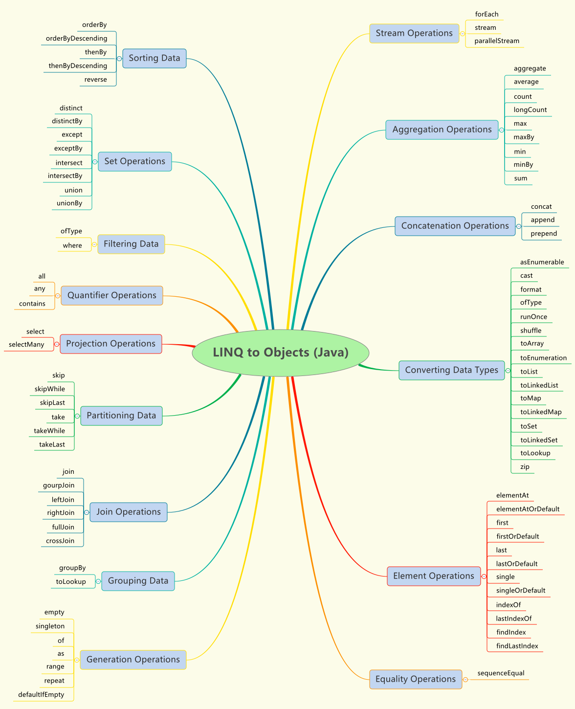

<!--README FILE-->
# LINQ to Objects (Java)

[](https://travis-ci.org/timandy/linq)
[](https://codecov.io/gh/timandy/linq)
[](https://search.maven.org/artifact/com.bestvike/linq)
[](https://github.com/timandy/linq/releases/latest)
[](https://github.com/timandy/linq/blob/master/LICENSE)

[中文文档](README_CN.md)

The term "LINQ to Objects" refers to the use of LINQ queries with any `IEnumerable<T>`.
You can use LINQ to query any enumerable collections such as `Primitive Array`, `Object Array`, `List`, `Collection` or `Iterable` and so on.
The collection may be user-defined or may be returned by a JDK API.

In a basic sense, LINQ to Objects represents a new approach to collections.
In the old way, you had to write complex `foreach` loops that specified how to retrieve data from a collection.
In the LINQ approach, you write declarative code that describes what you want to retrieve.

In addition, LINQ queries offer two main advantages over traditional `foreach` loops:
1. They are more concise and readable, especially when filtering multiple conditions.
2. They provide powerful filtering, ordering, and grouping capabilities with a minimum of application code.

LINQ queries also have some advantages over stream API:
1. Support `foreach` loops therefore you can break loop at any time.
2. IEnumerable can be traversed repeatedly.
3. LINQ is very easy to use, like `ToCollection`, `LeftJoin` and so on.
4. LINQ is faster than stream API in most complicated cases.

In general, the more complex the operation you want to perform on the data, the more benefit you will realize by using LINQ instead of traditional iteration techniques.

## Features
- Implemented all API of LINQ to Objects.
- More API and Tuple supported.
- Support for converting between IEnumerable and Stream.
- Android supported.


## Navigation


## API of Linq
- empty
- singleton
- ofNullable
- of
- as
- chars
- words
- lines
- split
- infinite
- loop
- enumerate
- iterate
- range
- repeat

## API of IEnumerable
- `forEach`
- `stream`
- `parallelStream`
- aggregate
- all
- any
- append
- asEnumerable
- average
- cast
- concat
- contains
- count
- `crossJoin`
- defaultIfEmpty
- distinct
- `distinctBy`
- elementAt
- elementAtOrDefault
- except
- `exceptBy`
- `findIndex`
- `findLastIndex`
- first
- firstOrDefault
- `format`
- `fullJoin`
- groupBy
- groupJoin
- `indexOf`
- intersect
- `intersectBy`
- join
- `joining`
- last
- `lastIndexOf`
- lastOrDefault
- `leftJoin`
- longCount
- max
- `maxBy`
- min
- `minBy`
- ofType
- orderBy
- orderByDescending
- prepend
- reverse
- `rightJoin`
- `runOnce`
- select
- selectMany
- sequenceEqual
- `shuffle`
- single
- singleOrDefault
- skip
- skipLast
- skipWhile
- sum
- take
- takeLast
- takeWhile
- toArray
- `toCollection`
- `toEnumeration`
- `toLinkedList`
- `toLinkedMap`
- `toLinkedSet`
- toList
- toLookup
- toMap
- toSet
- union
- `unionBy`
- where
- zip

## API of IGrouping extends IEnumerable
- getKey

## API of ILookup extends IEnumerable
- getCount
- get
- containsKey

## API of IOrderedEnumerable extends IEnumerable
- thenBy
- thenByDescending

## Tuple classes
- Tuple1
- Tuple2
- Tuple3
- Tuple4
- Tuple5
- Tuple6
- Tuple7
- TupleN

## Debug View (IntelliJ IDEA)
1. Open the settings dialog `File | Settings | Build, Execution, Deployment | Debugger | Data Views | Java Type Renderers`.
2. Click the `Add` button.
3. Type `IterableView` in `Renderer name`.
4. Type `java.lang.Iterable` in `Apply renderer to objects of type (fully-qualified name):`.
5. In the `When rendering a node` section, check `Use following expression:` and type `DebugView.getDebuggerDisplayText(this)`.
    If you get an error, press `Alt + Enter` to import the class.
6. Check `Use list of expression:` and type `**RESULT VIEW**` in the `Name` column.
    Type `DebugView.getDebuggerProxyObject(this)` in the `Expression` column.
    If you get an error, press `Alt + Enter` to import the class.
    It is recommended to check `On-demand` to enumerate the sequence if necessary.
7. If you want to see the default field of the `Iterable` instance, check `Append default children`.
8. Save your settings and try it out!

`Result view should be used with caution because of possible side-effects.`

## Maven
```
<dependency>
    <groupId>com.bestvike</groupId>
    <artifactId>linq</artifactId>
    <version>3.0.0</version>
</dependency>
```

## Gradle
```
compile 'com.bestvike:linq:3.0.0'
```

## Usage
`If you use java 8 or java 9, it is recommended to replace the complex return type with lombok.var or lombok.val.
If you use java 10 or later, it is recommended to replace the complex return type with var.`

- Join not empty strings.
```
String result = Linq.of("!@#$%^", "C", "AAA", "", "Calling Twice", "SoS", Empty)
        .where(x -> x != null && x.length() > 0)
        .aggregate((x, y) -> x + ", " + y);

System.out.println(result);
----
!@#$%^, C, AAA, Calling Twice, SoS
```

- Determine all positive numbers is even or not.
```
boolean result = Linq.of(9999, 0, 888, -1, 66, -777, 1, 2, -12345)
        .where(x -> x > 0)
        .all(x -> x % 2 == 0);

System.out.println(result);
----
false
```

- Determine any positive number is even or not.
```
boolean result = Linq.of(9999, 0, 888, -1, 66, -777, 1, 2, -12345)
        .where(x -> x > 0)
        .any(x -> x % 2 == 0);

System.out.println(result);
----
true
```

- Append a number at the end and insert two numbers in the header.
```
String result = Linq.range(3, 2).append(5).prepend(2).prepend(1).format();

System.out.println(result);
----
[1, 2, 3, 4, 5]
```

- Compute average of integer sequence.
```
double result = Linq.of(5, -10, 15, 40, 28).averageInt();

System.out.println(result);
----
15.6
```

- Concat two integer sequence.
```
String result = Linq.of(1, 2).concat(Linq.of(3, 4)).format();

System.out.println(result);
----
[1, 2, 3, 4]
```

## *License*
LINQ to Objects (Java) is released under the [Apache License 2.0](LICENSE).
```
Copyright 2017-2019 济南百思为科信息工程有限公司

Licensed under the Apache License, Version 2.0 (the "License");
you may not use this file except in compliance with the License.
You may obtain a copy of the License at

    http://www.apache.org/licenses/LICENSE-2.0

Unless required by applicable law or agreed to in writing, software
distributed under the License is distributed on an "AS IS" BASIS,
WITHOUT WARRANTIES OR CONDITIONS OF ANY KIND, either express or implied.
See the License for the specific language governing permissions and
limitations under the License.
```
