<!--自述文件-->
# LINQ to Objects (Java)

[](https://github.com/timandy/linq/actions)
[](https://codecov.io/gh/timandy/linq)
[](https://search.maven.org/artifact/com.bestvike/linq)
[](https://github.com/timandy/linq/releases/latest)
[](https://github.com/timandy/linq/blob/master/LICENSE)

[English Documentation](README.md)

术语“LINQ to Objects”指直接将 LINQ 查询与任何 `IEnumerable<T>` 集合一起使用。
可以使用 LINQ 来查询任何可枚举的集合，例如 `Primitive Array`、`Object Array`、 `List`、 `Collection` 或 `Iterable` 等等。
该集合可以是用户定义的集合，也可以是由 Java 开发包 API 返回的集合。

从根本上说，“LINQ to Objects”表示一种新的处理集合的方法。
采用旧方法，必须编写指定如何从集合检索数据的复杂的 `foreach` 循环。
而采用 LINQ 方法，只需编写描述要检索的内容的声明性代码。

此外，LINQ 查询与传统 `foreach` 循环相比具有两大优势：
1. 它们更简明、更易读，尤其在筛选多个条件时。
2. 它们使用最少的应用程序代码提供强大的筛选、排序和分组功能。

LINQ 查询与 Stream API 相比也具有一定优势：
1. 支持 `foreach` 循环，因此你可以随时中断循环。
2. 可以重复遍历 IEnumerable 接口对象。
3. LINQ 非常易于使用，如 `ToCollection`、`LeftJoin` 等。
4. 在大多数复杂情况下，LINQ 比 Stream API 更快。

通常，对数据执行的操作越复杂，就越能体会到 LINQ 相较于传统迭代技术的优势。

## 特性
- 实现了 LINQ to Objects 的所有 API。
- 支持更多 API 和元组。
- 支持 IEnumerable 和 Stream 互相转换。
- 支持 Android。


## 导航


## Linq 的 API
- empty
- singleton
- ofNullable
- of
- as
- chars
- words
- lines
- split
- infinite
- loop
- enumerate
- iterate
- range
- repeat

## IEnumerable 的 API
- `forEach`
- `stream`
- `parallelStream`
- aggregate
- all
- any
- append
- asEnumerable
- average
- cast
- concat
- contains
- count
- `crossJoin`
- defaultIfEmpty
- distinct
- `distinctBy`
- elementAt
- elementAtOrDefault
- except
- `exceptBy`
- `findIndex`
- `findLastIndex`
- first
- firstOrDefault
- `format`
- `fullJoin`
- groupBy
- groupJoin
- `indexOf`
- intersect
- `intersectBy`
- join
- `joining`
- last
- `lastIndexOf`
- lastOrDefault
- `leftJoin`
- longCount
- max
- `maxBy`
- min
- `minBy`
- ofType
- orderBy
- orderByDescending
- prepend
- reverse
- `rightJoin`
- `runOnce`
- select
- selectMany
- sequenceEqual
- `shuffle`
- single
- singleOrDefault
- skip
- skipLast
- skipWhile
- sum
- take
- takeLast
- takeWhile
- toArray
- `toCollection`
- `toEnumeration`
- `toLinkedList`
- `toLinkedMap`
- `toLinkedSet`
- toList
- toLookup
- toMap
- toSet
- union
- `unionBy`
- where
- zip

## IGrouping(继承 IEnumerable) 的 API
- getKey

## ILookup(继承 IEnumerable) 的 API
- getCount
- get
- containsKey

## IOrderedEnumerable(继承 IEnumerable) 的 API
- thenBy
- thenByDescending

## 元组类
- Tuple1
- Tuple2
- Tuple3
- Tuple4
- Tuple5
- Tuple6
- Tuple7
- TupleN

## 调试视图 (IntelliJ IDEA)
1. 打开设置对话框 `File | Settings | Build, Execution, Deployment | Debugger | Data Views | Java Type Renderers`。
2. 单击 `Add` 按钮。
3. 在 `Renderer name` 输入 `IterableView`。
4. 在 `Apply renderer to objects of type (fully-qualified name):` 输入 `java.lang.Iterable`。
5. 在 `When rendering a node` 小节，选中 `Use following expression:` 并输入 `DebugView.getDebuggerDisplayText(this)`。
    如果报错，按下 `Alt + Enter` 导入类。
6. 选中 `Use list of expression:` 并在 `Name` 列输入 `**RESULT VIEW**`。
    在 `Expression` 列输入`DebugView.getDebuggerProxyObject(this)`。
    如果报错，按下 `Alt + Enter` 导入类。
    建议选中 `On-demand`，以便在必要时枚举序列。
7. 如果你想查看 `Iterable` 实例的默认字段，选中 `Append default children`。
8. 保存设置，尝试一下吧！

`由于可能的副作用，应谨慎使用结果视图。`

## Maven
```
<dependency>
    <groupId>com.bestvike</groupId>
    <artifactId>linq</artifactId>
    <version>5.0.0</version>
</dependency>
```

## Gradle
```
implementation 'com.bestvike:linq:5.0.0'
```

## 用法
`如果使用 java 8 或 java 9，建议用 lombok.var 或 lombok.val 代替复杂的返回类型。
如果使用 java 10 或更高版本，建议使用 var 代替复杂的返回类型。`

- 拼接不为空的字符串。
```
String result = Linq.of("!@#$%^", "C", "AAA", "", "Calling Twice", "SoS", Empty)
        .where(x -> x != null && x.length() > 0)
        .aggregate((x, y) -> x + ", " + y);

System.out.println(result);
----
!@#$%^, C, AAA, Calling Twice, SoS
```

- 判断所有的正数是否全部为偶数。
```
boolean result = Linq.of(9999, 0, 888, -1, 66, -777, 1, 2, -12345)
        .where(x -> x > 0)
        .all(x -> x % 2 == 0);

System.out.println(result);
----
false
```

- 判断所有的正数是否存在任一偶数。
```
boolean result = Linq.of(9999, 0, 888, -1, 66, -777, 1, 2, -12345)
        .where(x -> x > 0)
        .any(x -> x % 2 == 0);

System.out.println(result);
----
true
```

- 在末尾追加一个数字并在头部插入两个数字。
```
String result = Linq.range(3, 2).append(5).prepend(2).prepend(1).format();

System.out.println(result);
----
[1, 2, 3, 4, 5]
```

- 计算整数序列的平均值。
```
double result = Linq.of(5, -10, 15, 40, 28).averageInt();

System.out.println(result);
----
15.6
```

- 连接两个整数序列。
```
String result = Linq.of(1, 2).concat(Linq.of(3, 4)).format();

System.out.println(result);
----
[1, 2, 3, 4]
```

## *许可证*
LINQ to Objects (Java) 是在 [Apache License 2.0](LICENSE) 下发布的。
```
Copyright 2017-2019 济南百思为科信息工程有限公司

Licensed under the Apache License, Version 2.0 (the "License");
you may not use this file except in compliance with the License.
You may obtain a copy of the License at

    http://www.apache.org/licenses/LICENSE-2.0

Unless required by applicable law or agreed to in writing, software
distributed under the License is distributed on an "AS IS" BASIS,
WITHOUT WARRANTIES OR CONDITIONS OF ANY KIND, either express or implied.
See the License for the specific language governing permissions and
limitations under the License.
```
